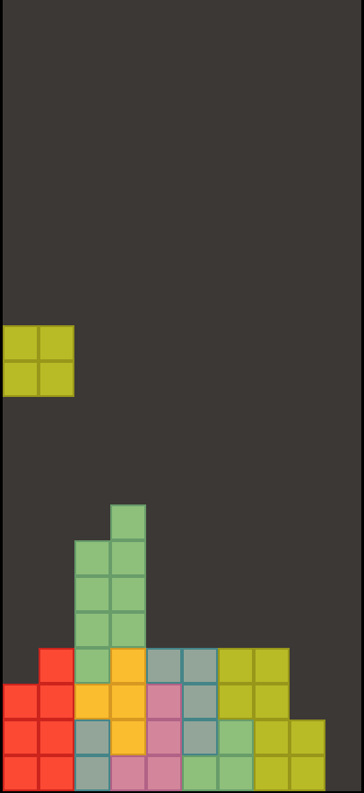

# MF Libs

Single Header libraries/utilities for creating games etc.

* [mf.h](./src/mf.h) Common utilities like typedefs, stretchy buffer etc.
* [mf_platform.h](./src/mf_platform.h) Platform utility for opening windows and read keyboard, mouse input
* [mf_math.h](./src/mf_math.h) Math utilities like vector implementation
* [mf_test.h](./src/mf_test.h) Unit test framework
* [mf_renderer.h](./src/mf_renderer.h) Basic renderer push buffer implementation
* [mf_opengl.h](./src/mf_opengl.h) Opengl utility functions


## Examples

In the example directory there are some examples how to use the library.

```
make examples

./build/example-platform  # Example using mf_platform
./build/example-renderer  # Example using mf_renderer
./build/tetris            # Small tetris game
```


## Tests

Compile and execute tests

```
make test
```




## Coding Style

```c
// function
mf_my_func(void);
mf__my_private_func(void);

// variable
int myVar;

// struct

typedef struct MF_MyStruct {
    int foo;
} MF_MyStruct;
```

## Checklist

[x] mf.h
[x] mf_file.h
[ ] mf_font.h
[ ] mf_gui.h
[ ] mf_math.h
[ ] mf_math.tmpl.h
[ ] mf_opengl.h
[ ] mf_opengl2.h
[ ] mf_platform.h
[ ] mf_renderer.h
[ ] mf_string.h
[ ] mf_test.h
[ ] mf_vector.h
